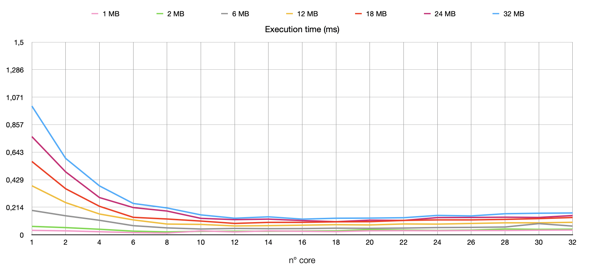

# MPI-WordCount-AWS

This is a course project of "concurrent and parallel programming on the cloud" by university of Salerno.

## **Problem Statement**

The word count is the number of words in a document or passage of text. Word counting may be needed when a text is required to stay within specific numbers of words.

Word count is commonly used by translators to determine the price of a translation job. Word counts may also be used to calculate measures of readability and to measure typing and reading speeds (usually in words per minute). When converting character counts to words, a measure of 5 or 6 characters to a word is generally used for English
We will be doing a version of map-reduce using MPI to perform word counting over large number of files


## Idea 💡

There are four main steps for this program:
- All the nodes read a directory and create a files's list, which every node is associated with the name of the file and its size expressed in byte and an offest setted at 0 (i'll talk about this later). 
- The MASTER process calculates in equal parts, based on the files's size, which file and offset each process must begins to count. It then sends to each process the file_name, offset, number of byte to count. 
- The SLAVES from the information received by the MASTER, scroll their local list of file and start to analyze the files, adding the words occurrencies into a Hash_map. Finally send the couple "word" - "value" to the MASTER. 
- The MASTER analyze the rest (if any) of the division of job. Than receive all the slave Hash_map, merge it into it's local Hash_map and write a report file, where are listed all the occurrencies. 

Detail: With one process all the work will be performed on the master, with two processes the work will be divided in half MASTER-SLAVE, from 3 processes onwards the MASTER will only take care of splitting the jobs and bringing together the results.


## **Road to Solution** (first approach)
In the beginning the main idea was to split job for the SLAVES, by lines. This quick solution was figured out for resolve the problem of overlapping the words counted by the SLAVES, allowing to have a fairly correct division of jobs. This solution seems good at beginning on my local machine, the test done didn't give me very bad results. This view changed a lot into the AWS enviroment as you can see into the graph below


Those tests are done with different sizes of workload and using an incremental number of process togherer. The first test is done only with the MASTER process, counting all the word for than report them, into the second test are executed two process MASTER-SLAVE and so on adding always more SLAVES.
As we can notice on the experiment with 4 process, the exectuion time have a significant decrease, which gradually slows down to the test with 14 processes. After that it remains in a fairly stationary situation, seemed the best speed-up this algoritm can do, but from the test with 20 process the program started to increase exponentially the exec. time, afther a bit of research, i figured out that the function pertinent at the count of the lines in each file for determine the "size" slowed down a lot the programm. 


## **Final Solution** (second approach)

Since I could not find a way to speed up the reading of the lines of a file significantly, i had to change approach. So I rewrote some functions and readaprt the program, in order to divide the work among the slaves based on the bytes of each file. Solving the problem of word overlapping, always making a process complete to read a word even if it finishes its part of the work. But at the same time each process starts counting the first word only when it encounters a white space, assuming that the previous process has already counted it, even if its offset is in the center of a word. 


I reported here the strong efficiency performance, as we can see this is not the optimal soliution but we have a considerable impovement on the execution time, rather than the first experiment.


Since I wasn't happy with the execution times found that the work-splitting method was not efficient enough as the processes increased. To check I re-run the tests without considering this part of code in the time count: 



Here the times remain on fairly low values even with 32 cores, increasing only slightly on the final experiments. This beacause with this approach each process must wait the master for receive the staring point and start to analyze the files. But i still haven't developed a new approach for solve this issue. 


## Implementation Details
To develop this software, it was chosen to use C as the programming language and the MPI (Message Passing Interface) library to work in distributed logic. From the following flow chart it is possible to highlight the main calculation steps that have allowed us to find a solution to the question posed. Subsequently the various points will be illustrated in detail.


### **file_utils.c**
Let's start from the methods for scan the directory of the files to read. In order to do this I've create a list of nodes:
```c
typedef struct node {
    char *fname; 		    // File name
    long size;				  // File's size in byte 
    long seek_line;		  // Starting procces point for start to analyze
    struct node *next;
};
```

The first function to be launched scan the files in a folder /Files and for each file memorize the name, the size, and set a seek_line which will be filled later to calculate while the master calculate the chunks to analyze for each process 
```c
create_list_of_files_from_dir()
```
For get the size of each file i created this functuon wich use the* fseek() *and *ftell()* for get the size in byte:
```c
	....
    f = fopen(address, "r");
    if (f == NULL) 
        printf("Error open file for scan the lines\n");
    fseek(f, 0L, SEEK_END);
    long size = ftell(f);
    fclose(f);
	...
```
In the first problem approach, this function scrolled through each character of the file to count lines ( '\n' ), slowing down the execution considerably.

Then I wrote some helper functions, respectively for calculate total file size in bytes, clear file list and write a report file with the occurencies of each word
```c
long get_file_size(const char* filename)
void free_list_of_files()
void build_report_file(float time, int rank)
```

### **frequency_list.c**
As a structure to store the count of occurrences I used a HashMap, in order to speed up the add, update and search operations, with time O(1) in the best case.
```c
struct hashNode {
    char word[WORDLENGHT];
    int value;
    struct hashNode *next;
};
```
To manage the collisions I made sure that if a HashMap index was already used, it scrolls to the next, as show below.


To do this, the search function, after calculating the hash, will scroll through each node in that index, as if it were a list, comparing the characters in the 'word' field
```c
struct hashNode *search(char *wrd) {
    //  get the hash 
    int hashIndex = hash(wrd);  
    struct hashNode *node = hashTab[hashIndex];
	
    //  scroll nodes with the same HashIndex
    while (node != NULL ) {
        if (strcmp(node->word , wrd) == 0) 
            return node; 
        node = node->next; 
    }
    return NULL; 
}
```
The function for the insert_update() check if the word is already present, and if so it just increase the value relative to the occurrences, otherwise it will create a new node into the HashMap.
```c
void insert_update(char *wrd, int val)
```


### **schedule.c**
This file contain the core functions for count the words and split jobs.

The first function is used by the MASTER in order to calculate where each process must start to count. Take in input the starting point and the size to analyze and scrolls the list of files, entered previously, and will set the seek_line field, this indicates the offset where each process will start its job
```c
node *get_starting_point(long start, long part) {
    node *head = getHead(); 
    node *curr = head;

    long sectionStart = start;
    long sectionSize = head->size;

    //  if i can analyze the first file set the "seek" point
    if(sectionSize > start) {
        head->seek_line = start;
    }
    else {  //  otherwise scroll the list till you doun't reach your starting point
        sectionSize = 0;    
        while (curr != NULL && sectionSize <= sectionStart) {  

            sectionSize += curr->size;  
            // if another process analyzed this, remove it from the section and update the head = starting poing
            if(sectionSize <= sectionStart) {   
                start -= curr->size;       
                head = curr->next;     
                head->seek_line = start;
            }
            curr = curr->next;     
        }
    }
    return head; // process starting point 
}
```
The second funtion, is used by the slaves, after the master splitted the work for each slave he will do an MPI_Send, passing the information for each worker (file from start analyzing and the chunk_size to analyze). This information will be passed to this function, where each process will scroll through its internal list of files to get to the starting point of the job.
Finally it will analyze the files until the bytes counted are equal to the size of the job assigned by the master. 
```c
void compute_word_frequency_slave(buffer_split_work *work) {
    FILE *F;
    node *head = getHead();     

    // scroll the list till u don't reach your starting point 
    while(strcmp(head->fname, work->f_name)) {
        head = head->next;
    }

    long word_counted = 0;
    int firstFile = 1;
    //  count the words untill u don't finish your part of work
    while (head != NULL && word_counted < work->part_size) {

        char address[100] = FILEPATH PATHMODE;
        strcat(address, head->fname);  

        F = fopen(address, "r");
        // set the seek to the starting point-1, for the first tile to read
        if (firstFile) {
            fseek(F, work->start, SEEK_SET);
            firstFile = 0;
        }
        else // otherwise start from the beginning
            work->start = 0;
        word_counted = prepare_to_count(F, word_counted, work->start, work->part_size);

        fclose(F);
        head = head->next;
    }
} 
```
A similar version will be used by the master, the only difference is that it will calculate at the moment where to start analyzing

The third function, is a support function, used by a process if it does not start analyzing a file from the beginning.
In fact, from the point of view in which every process finishes analyzing a word, even if it offeset has exceeded the characters it was supposed to analyze. A process that will continue the work, start analyzing from the first next word.
```c
long prepare_to_count(FILE *F, long word_counted, long start, long part) {
    int ch = 0; 
    //  if another process opened this file, go to your starting line
     if (start != 0) {
        while(1) {
            ch = fgetc(F);
            word_counted++;
            if (ch == EOF) 
                return 0;
            else if (ch == ' ' || ch == '\n') {
                break;
            }
        }
    }
    return count_words(F, word_counted, part);
}
```
The last function `count_words(F, word_counted, part);` is used for scan each char in a file, and consider a word each sequence of at least 4 chars which contain only letter from A to Z, skipping symbol and numbers
```c
	...
    // do this unltil you read all the chars in the files && you didn't finish u're part of work || u're reading a word
    while (( (ch = fgetc(F)) != EOF) && ((part >= words_counted) || (len > 0) )) {

        words_counted++;
        ch = tolower(ch);  
        // check the ascii for the letters a-z
        if (ch > 96 && ch < 123 ) {
            word[len] = ch;
            len++;
        }
        else { 
            // min size for count a word 
            if (len > 3) 
                insert_update(word, 1);
        
            // reset the string
            memset(word, '\0', WORDLENGHT);
            len = 0;
        }
    }
	....
```
### **mpi_utils.c**
The last file contain the support functions, which will use the MPI library. 
First of all i've defined two differents MPI_Datatype, based on this two structures and all the data excanged will be sended in those formats. The first struct contain the word and the occurency of each, the second contain the information calculated by the MASTER for split the jobs equally.
```c
typedef struct buffer_frequency_list {
    char word[WORDLENGHT];
    int value;
} ;
typedef struct buffer_split_work { 
    long part_size;
    long start;
    char f_name[60];
} ;
```
The functions for sending`void master_split_work(buffer_split_work *send_work, int rank)`and receiving`void slave_receive_work()`jobs information are quite simple so I will leave out the description of these.

The function launched by the slaves for send to the master the job done, perform a no-blocking *MPI_Isend()* for send the size of the array that the master must be ready to receive. Then store all the information of the local HashMap into an array and send it to the master with *MPI_Send()*
```c
	...
    MPI_Isend(&size_hstab, 1, MPI_INT, 0, tag, MPI_COMM_WORLD, &buffer_size_request);
    buffer_frequency_list *send = (buffer_frequency_list*) calloc(size_hstab, sizeof(buffer_frequency_list));
	
    int j=0;
    for (int i = 0;  i < HASHSIZE ; i++) {
        link = hashTab[i];
        while (link != NULL) {
            send[j].value = link->value;
            strcpy(send[j].word, link->word);
            j++;
            link = link->next;
        }
    }
    MPI_Wait(&buffer_size_request, MPI_STATUS_IGNORE);
    MPI_Send(send, size_hstab, mpi_elemnt, 0, tag, MPI_COMM_WORLD);
    free(send);  
	...
```
in a similar way, the MASTER receives information from each slave and iterate through the received array, updating the local hashtab, using the function below
```c
void reduce(buffer_frequency_list *send, int size) {
    //  scroll the array and add the items into the MASTER hashTab
    for (int i = 0; i < size ; i++) {
        insert_update(send[i].word, send[i].value);
    }
}
```


# Benchmark
The solution has been tested over (up to) 4 AWS EC2 t2.2xlarge (8 vCPU machines) using in input 3 books in txt format and duplicated in order to increase the input size. 

The performance have been evaluated in terms of strong and weak scalability, which means using an increasing number of processors over a fixed input and using an increasing number of processors with the load-per-processor fixed respectively.

## Strong Efficiency

The strong scalability tests showing runtimes have already been reported above. So i report here the strong efficiency (second aproach)


The bar plot shows that the trend is acceptable till 18 cores, but of course for a small input size, the efficiency is not good (this is because is not convenient to use so much processors for a small input size) afterwards, the efficiency remains quite low.


## Weak scalability 

Weak scalability tests show the behavior of the algorithm, where the scaled speedup is calculated based on the amount of work done for a scaled problem size. Overall, execution times seem not to vary too much over the graph showed above, where the efficiency remains above 20% up to 18-20 vCPU.


# Requirements

In oder to replicate this experiments you need to install CMake and of course the MPI library
  ``` bash
brew install open-mpi
brew install cmake
```
After downloaded the repository go into the WordCount dir and execute the following commands for compile the source code:
  ``` bash
mkdir build
cd build
cmake ..
make 
mv word-count ..
cd ..
```
# How to run
Now you can run with the following command (change the paramenter -np for increase or decrese the number of process)
  ``` bash
  mpirun --allow-run-as-root -np 4 word-count
```
The result of an execution will be the following:
```
Files analyzed in 0.282004 MS check the /logs folder for the reports 
```
The you can check the report of the MASTER
```
cat Report process 0.txt

      WORD           -       OCCURRENCY
pudico                 -           6
immotivate           -           6
mengaldo             -          12
rotolato               -           6
proibizioni           -           6
acquistato           -           6
avrete                 -          42
	...							    ...
scalciando           -           6

             WORDS: 567810
             OCCURRENCES: 18990

             TIME: 0.111355 MS
```


